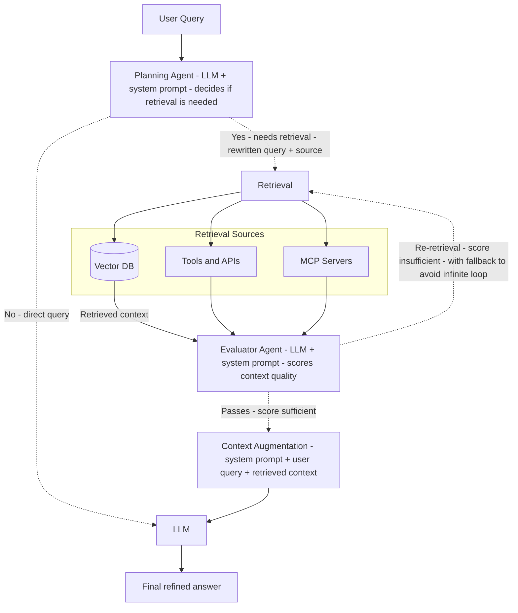

# Retriever

A local-first study assistant with **Agentic RAG**, vector database, and flexible LLM provider selection.

This is the public monorepo that aggregates the two main packages of the Retriever project. It serves as the entry point for anyone wanting to explore, use, or contribute to the project.

## What is Retriever?

Retriever is a study and content creation assistant that uses Agentic RAG architecture. It:

- Indexes your PDFs and text notes into a local vector database
- Converses with you as a tutor, answering based on **your own materials**
- Runs embeddings locally with Ollama (your data never leaves your machine)
- Lets you choose between local LLM (Ollama) or remote API (OpenRouter)

## Packages

| Package | Description |
|---------|-------------|
| [`packages/retriever-api`](packages/retriever-api) | FastAPI backend with LangChain/LangGraph, ChromaDB, and Agentic RAG pipeline |
| [`packages/retriever-web`](packages/retriever-web) | SvelteKit 5 frontend with chat interface and Electron desktop support |

## Quick Start

### Prerequisites

- **Python 3.11+** (for the backend)
- **Node.js 20+** (for the frontend)
- **Ollama** installed and running ([download here](https://ollama.com/download))

### 1. Clone the repository

```bash
git clone --recurse-submodules https://github.com/jhiltonsantos/retriever.git
cd retriever
```

If submodules are empty:

```bash
git submodule update --init --recursive
```

### 2. Set up Ollama (required for embeddings)

Pull the embedding model (always required, even when using remote LLM):

```bash
ollama pull nomic-embed-text
```

For local LLM (optional, if you don't want to use OpenRouter):

```bash
ollama pull llama3.1
```

**Important:** Use `llama3.1` (with `.1`), not `llama3`. The base `llama3` doesn't support tool calling and will fail.

Verify Ollama is running:

```bash
curl http://localhost:11434/api/tags
```

### 3. Start the backend

```bash
cd packages/retriever-api
python3 -m venv .venv
source .venv/bin/activate  # Windows: .\.venv\Scripts\Activate.ps1
pip install -r requirements.txt
cp .env.example .env
```

Edit `.env` to choose your LLM provider:

```bash
# Option 1: 100% local (no API key needed)
LLM_PROVIDER=ollama

# Option 2: Remote via OpenRouter (embeddings still local)
LLM_PROVIDER=openrouter
LLM_API_KEY=your-api-key-here
```

Start the API:

```bash
uvicorn main:app --reload --host 127.0.0.1 --port 8000
```

Interactive API docs: [http://127.0.0.1:8000/docs](http://127.0.0.1:8000/docs)

### 4. Start the frontend (in another terminal)

```bash
cd packages/retriever-web
npm install
npm run dev
```

Open [http://localhost:5173](http://localhost:5173)

### 5. Verify it's working

1. Go to **Index materials** tab, upload a PDF or paste text — confirm `chunks_indexed` > 0
2. Go to **Chat** and ask something about your indexed material — the answer should cite sources

## Recommended Tools

### For Embeddings (always local)

- **nomic-embed-text** (via Ollama) — fixed, always runs locally
  - Your documents never leave your machine
  - Fast and efficient for semantic search

### For LLM (your choice)

**Local (Ollama):**
- `llama3.1` — good balance of speed and quality
- `qwen2.5` — strong reasoning capabilities
- `mistral-nemo` — efficient and accurate

**Remote (OpenRouter):**
- `deepseek/deepseek-v4-flash-0731` — default, fast and cost-effective
- Any OpenAI-compatible model via OpenRouter

**Important:** The model must support tool calling. The `/ask` endpoint uses tools like `vector_search`, `list_documents`, and `summarize_chunks`.

## Architecture

```
┌─────────────────┐
│  retriever-web  │  SvelteKit SPA + Electron
│   (Frontend)    │
└────────┬────────┘
         │ HTTP
         ↓
┌─────────────────┐
│ retriever-api   │  FastAPI + LangChain/LangGraph
│   (Backend)     │
└────────┬────────┘
         │
    ┌────┴────┐
    ↓         ↓
┌────────┐ ┌──────────┐
│ChromaDB│ │  Ollama  │
│(local) │ │(embed +  │
│        │ │  LLM)    │
└────────┘ └──────────┘
                ↓
         ┌──────────┐
         │OpenRouter│
         │(optional)│
         └──────────┘
```

## How Agentic RAG Works

Unlike traditional RAG (retrieve → augment → generate in a single pass), Retriever uses an **Agentic RAG** architecture with intelligent decision-making and feedback loops.

### The Pipeline



### Key Components

**1. Planning Agent**
- Analyzes the user's question and decides: *Do I need to retrieve external data to answer this?*
- If no retrieval needed (e.g., "What is a list in Python?"), goes directly to generation
- If retrieval needed, rewrites the query for better results and chooses the right tools

**2. Multi-Source Retrieval**
- Searches across vector databases (ChromaDB), external APIs, and tools
- More robust than single-pass RAG

**3. Evaluator Agent**
- The game-changer: analyzes retrieved context and assigns a quality score
- Asks: *Does this context actually answer the question?*
- If score is insufficient, triggers re-retrieval with better queries
- If score is sufficient, passes context to augmentation

**4. Context Augmentation & Generation**
- Builds the final prompt with system instructions, user query, and validated context
- LLM generates a refined, accurate answer

**5. Loop Control & Fallback**
- `MAX_RETRIEVAL_LOOPS` (default: 2) prevents infinite loops
- If evaluator never satisfies, the system falls back to the best context available
- Always terminates with an answer, even if material is insufficient

### Why Agentic RAG?

Traditional RAG has limitations:
- Always retrieves, even when unnecessary (wastes resources)
- Retrieves only once (no second chances if context is bad)
- No quality control on retrieved content
- Can't adapt query based on initial results

Agentic RAG solves these by:
- **Deciding** when to retrieve (saves time and resources)
- **Evaluating** context quality before using it
- **Re-trying** with better queries if needed
- **Guaranteeing** termination with fallback mechanism

## Features

- **Local-first**: Embeddings always run locally, your data stays on your machine
- **Agentic RAG**: Planner decides when to retrieve, evaluator scores context, re-retrieval loop with fallback
- **Multiple LLM providers**: Switch between Ollama (local) and OpenRouter (remote) via UI
- **Persistent conversations**: Chat history stored in SQLite, multiple conversations supported
- **Material catalog**: Track all indexed documents with metadata
- **Desktop app**: Optional Electron wrapper for native experience (Windows installer available)

## Documentation

Each package has its own README with detailed information:

- [retriever-api README](packages/retriever-api/README.md) — Backend architecture, endpoints, and configuration
- [retriever-web README](packages/retriever-web/README.md) — Frontend structure, routes, and UI components

## Design

View the UI prototype and design system on Figma:

[Retriever Design on Figma](https://www.figma.com/design/RtK5mim16aWxxAXAnqudkN/Retriever?m=auto&t=SKNgaiJiXt5qUVHZ-1)

## Development

### Publishing changes

Since this is a monorepo with submodules, publishing requires three commits:

```bash
# 1. Commit in the package
cd packages/retriever-api
git add . && git commit -m "your message" && git push origin main

# 2. Update pointer in retriever/
cd ..
git add packages/retriever-api && git commit -m "chore: update retriever-api" && git push origin main

# 3. (If you have access to the main private repo)
# Update pointer in retriever-principal/
```

## License

To be defined.
