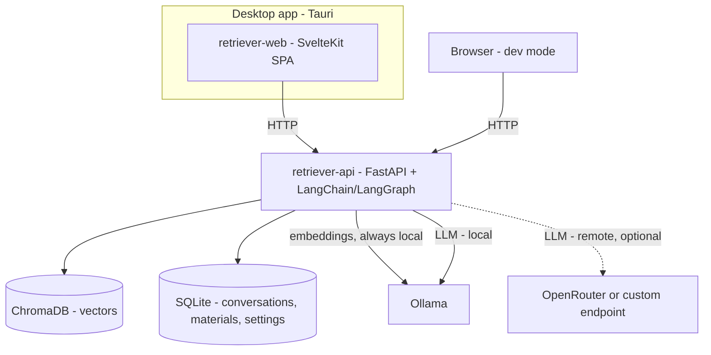
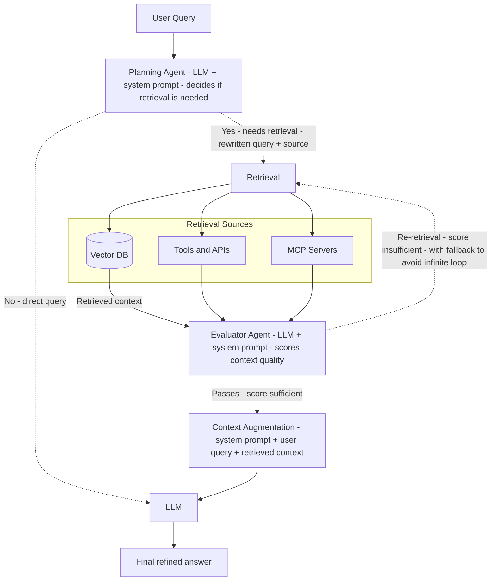

# Retriever

A local-first study assistant with **Agentic RAG**, vector database, and flexible LLM provider selection.

Retriever ships as a desktop app for Linux and Windows, and can also be run from source in the browser. This repository is the public monorepo with the three packages that make up the project — backend, frontend, and desktop shell — and is the entry point for anyone wanting to use, explore, or contribute to it.

## Download

Pre-built desktop apps are published on the [Releases page](https://github.com/jhiltonsantos/retriever/releases). Grab the latest build from [`releases/latest`](https://github.com/jhiltonsantos/retriever/releases/latest):

| Platform | File | Notes |
|----------|------|-------|
| Linux (x86_64) | `Retriever_<version>_amd64.AppImage` | `chmod +x` the file, then run it |
| Windows (x64) | `Retriever_<version>_x64-setup.exe` | NSIS installer |

macOS is not supported.

Before opening the app you need [Ollama](https://ollama.com/download) installed and running with the embedding model pulled (`ollama pull nomic-embed-text`) — embeddings always run locally, even when the chat LLM is remote. Nothing else is required: the installer bundles the backend, so no Python or Node.js is needed.

**Windows note:** the installer is not code-signed yet, so Windows SmartScreen may show an "unrecognized app" warning. Choose **More info** and then **Run anyway** if you downloaded it from this repository's Releases page.

All versions are still pre-releases (`0.1.0-beta.x`). See the [CHANGELOG](CHANGELOG.md) for what each release contains and its known limitations.

## What is Retriever?

Retriever is a study and content creation assistant that uses Agentic RAG architecture. It:

- Indexes your PDFs and text notes into a local vector database
- Converses with you as a tutor, answering based on **your own materials**, with sources and the agent's steps shown next to each answer
- Runs embeddings locally with Ollama (your data never leaves your machine)
- Lets you choose between a local LLM (Ollama), OpenRouter, or any OpenAI-compatible endpoint
- Maps your library as a similarity graph, so related materials show up close to each other

## Packages

This is a plain monorepo: all three packages are regular directories, with no git submodules to initialize.

| Package | Description |
|---------|-------------|
| [`packages/retriever-api`](packages/retriever-api) | FastAPI backend with LangChain/LangGraph, ChromaDB, SQLite, and the Agentic RAG pipeline |
| [`packages/retriever-web`](packages/retriever-web) | SvelteKit 5 frontend (static SPA) with chat, library, and settings |
| [`packages/retriever-desktop`](packages/retriever-desktop) | Tauri desktop shell that loads the SPA and spawns the backend as a sidecar |

## Quick Start

Pick one of the three paths below. The desktop app is the easiest; Docker Compose and the manual setup are meant for development.

### Path A: Desktop app (recommended)

1. Install and start [Ollama](https://ollama.com/download), then pull the embedding model:

   ```bash
   ollama pull nomic-embed-text
   ```

2. Download the AppImage or the Windows installer from the [Releases page](https://github.com/jhiltonsantos/retriever/releases/latest) and open it.
3. Choose your LLM provider in **Settings** (see [Choose an LLM](#choose-an-llm) below).

Your data (vector index, conversations, settings) lives in the app's data directory, outside the install location, so uninstalling does not delete your indexed material. API keys are stored in the operating system keyring.

### Path B: Docker Compose (development)

**Prerequisites:** Ollama running on the host with `nomic-embed-text` pulled, and [Docker](https://docs.docker.com/get-docker/) with Docker Compose.

```bash
git clone https://github.com/jhiltonsantos/retriever.git
cd retriever
docker compose up --build
```

- Frontend: [http://localhost:5173](http://localhost:5173)
- Backend: [http://localhost:8000](http://localhost:8000)
- Both containers hot-reload on source changes (bind-mounted) — no rebuild needed while editing.
- Ollama keeps running on the host; the API container reaches it automatically.
- Configure your LLM provider from the app's **Settings** screen — saved settings persist in SQLite across restarts. Optionally, `cp .env.example .env` and fill in `LLM_API_KEY` beforehand if you'd rather pre-seed the default provider via env vars.
- Stop with `docker compose down` (add `-v` only if you also want to drop any named volumes — this setup doesn't create any, your data lives in the bind-mounted package folders).

### Path C: Manual (Python + Node)

**Prerequisites:** Ollama with `nomic-embed-text` pulled, **Python 3.11+**, and **Node.js 20+**.

```bash
git clone https://github.com/jhiltonsantos/retriever.git
cd retriever
```

**Start the backend**

```bash
cd packages/retriever-api
python3 -m venv .venv
source .venv/bin/activate  # Windows: .\.venv\Scripts\Activate.ps1
pip install -r requirements.txt
cp .env.example .env
```

Edit `.env` to choose your LLM provider:

```bash
# Option 1: 100% local (no API key needed)
LLM_PROVIDER=ollama

# Option 2: Remote via OpenRouter (embeddings still local)
LLM_PROVIDER=openrouter
LLM_API_KEY=your-api-key-here
```

Start the API:

```bash
uvicorn main:app --reload --host 127.0.0.1 --port 8000
```

Interactive API docs: [http://127.0.0.1:8000/docs](http://127.0.0.1:8000/docs)

**Start the frontend (in another terminal)**

```bash
cd packages/retriever-web
npm install
npm run dev
```

Open [http://localhost:5173](http://localhost:5173)

**Run the desktop shell from source (optional)**

Requires the Rust toolchain. See the [desktop package](packages/retriever-desktop) and the backend's `scripts/` folder for how the sidecar is built and bundled.

```bash
cd packages/retriever-desktop
npm install
npm run dev
```

### Choose an LLM

Open **Settings** (sidebar) and use the **Providers** tab. Each provider keeps its own model and credentials, so you can switch without retyping:

- **Ollama** — local, no key needed
- **OpenRouter** — remote, needs an API key
- **Custom** — any OpenAI-compatible endpoint (LM Studio, vLLM, a self-hosted server); the API key is optional

For Ollama as the chat LLM, pull a tool-calling model:

```bash
ollama pull llama3.1
```

**Important:** Use `llama3.1` (with `.1`), not `llama3`. The base `llama3` doesn't support tool calling and will fail.

Verify Ollama is running:

```bash
curl http://localhost:11434/api/tags
```

### Verify it's working

1. Open **Indexar materiais** in the sidebar, upload a PDF or paste text — confirm the material is indexed (`chunks_indexed` > 0).
2. Start a new conversation and ask something about your indexed material — the answer should cite sources.
3. Open **Visualizar materiais** to see the indexed material in the list and in the graph view.

## Recommended Tools

### For Embeddings (always local)

- **nomic-embed-text** (via Ollama) — fixed, always runs locally
  - Your documents never leave your machine
  - Fast and efficient for semantic search

### For LLM (your choice)

**Local (Ollama):**
- `llama3.1` — good balance of speed and quality
- `qwen2.5` — strong reasoning capabilities
- `mistral-nemo` — efficient and accurate

**Remote (OpenRouter):**
- `deepseek/deepseek-v4-flash-0731` — default, fast and cost-effective
- Any OpenAI-compatible model via OpenRouter

**Custom endpoint:** any model your server exposes, as long as it supports tool calling.

**Important:** The model must support tool calling. The `/ask` endpoint uses tools like `vector_search`, `list_documents`, and `summarize_chunks`.

## Architecture


```mermaid
flowchart TD
  subgraph desktop [Desktop app - Tauri]
    WEB[retriever-web - SvelteKit SPA]
  end

  WEB -->|HTTP| API[retriever-api - FastAPI + LangChain/LangGraph]
  BROWSER[Browser - dev mode] -->|HTTP| API

  API --> CHROMA[(ChromaDB - vectors)]
  API --> SQLITE[(SQLite - conversations, materials, settings)]
  API -->|embeddings, always local| OLLAMA[Ollama]
  API -->|LLM - local| OLLAMA
  API -.->|LLM - remote, optional| REMOTE[OpenRouter or custom endpoint]
```

- **Desktop app:** Tauri loads the static SPA and spawns `retriever-api` (packaged with PyInstaller) as a sidecar, waiting on its health check behind a splash screen. In dev mode the same SPA runs in a browser against the API on port 8000.
- **Backend:** a stateless FastAPI service. Conversations, the materials catalog, the user profile, and provider settings live in SQLite; vectors live in ChromaDB.
- **Models:** embeddings always go to local Ollama; the chat LLM is whichever provider you selected.

## How Agentic RAG Works

Unlike traditional RAG (retrieve → augment → generate in a single pass), Retriever uses an **Agentic RAG** architecture with intelligent decision-making and feedback loops.

### The Pipeline


```mermaid
flowchart TD
  Q[User Query] --> PA[Planning Agent - LLM + system prompt - decides if retrieval is needed]

  PA -.->|No - direct query| LLM[LLM]
  PA -.->|Yes - needs retrieval - rewritten query + source| RT[Retrieval]

  subgraph sources [Retrieval Sources]
    VDB[(Vector DB)]
    TOOLS[Tools and APIs]
    MCP[MCP Servers]
  end

  RT --> VDB
  RT --> TOOLS
  RT --> MCP

  VDB -->|Retrieved context| EV[Evaluator Agent - LLM + system prompt - scores context quality]
  TOOLS --> EV
  MCP --> EV

  EV -.->|Re-retrieval - score insufficient - with fallback to avoid infinite loop| RT
  EV -.->|Passes - score sufficient| CA[Context Augmentation - system prompt + user query + retrieved context]

  CA --> LLM
  LLM --> ANS[Final refined answer]
```

### Key Components

**1. Planning Agent**
- Analyzes the user's question and decides: *Do I need to retrieve external data to answer this?*
- If no retrieval needed (e.g., "What is a list in Python?"), goes directly to generation
- If retrieval needed, rewrites the query for better results and chooses the right tools
- Uses the recent conversation history to resolve follow-ups like "and the second point?"

**2. Multi-Source Retrieval**
- Searches across vector databases (ChromaDB), external APIs, and tools
- More robust than single-pass RAG

**3. Evaluator Agent**
- The game-changer: analyzes retrieved context and assigns a quality score
- Asks: *Does this context actually answer the question?*
- If score is insufficient, triggers re-retrieval with better queries
- If score is sufficient, passes context to augmentation

**4. Context Augmentation & Generation**
- Builds the final prompt with system instructions, user query, and validated context
- LLM generates a refined, accurate answer

**5. Loop Control & Fallback**
- `MAX_RETRIEVAL_LOOPS` (default: 2) prevents infinite loops
- If evaluator never satisfies, the system falls back to the best context available
- Always terminates with an answer, even if material is insufficient

### Why Agentic RAG?

Traditional RAG has limitations:
- Always retrieves, even when unnecessary (wastes resources)
- Retrieves only once (no second chances if context is bad)
- No quality control on retrieved content
- Can't adapt query based on initial results

Agentic RAG solves these by:
- **Deciding** when to retrieve (saves time and resources)
- **Evaluating** context quality before using it
- **Re-trying** with better queries if needed
- **Guaranteeing** termination with fallback mechanism

## Features

- **Desktop app**: native installers for Linux (AppImage) and Windows (`.exe`), with the backend bundled — no Python or Node.js needed. Built on Tauri, with a splash screen, single-instance behavior, and API keys kept in the OS keyring
- **Local-first**: Embeddings always run locally, your data stays on your machine
- **Agentic RAG**: Planner decides when to retrieve, evaluator scores context, re-retrieval loop with fallback
- **Chat with sources and agent steps**: every answer shows the passages it came from and what the agent did to get there
- **Multiple LLM providers**: Ollama (local), OpenRouter (remote), or any OpenAI-compatible custom endpoint — each configured independently from the Settings screen
- **Persistent conversations**: multiple conversations stored in SQLite, listed in the sidebar and searchable from the History modal
- **Material catalog**: track every indexed PDF or text note with its metadata, and remove it when you no longer need it
- **Materials graph**: an interactive similarity graph of your library, where only mutually-nearest materials are linked, so related topics cluster together
- **Light and dark themes**: one design system, two themes, remembered between sessions
- **Automated releases**: every version bump merged into `main` builds the Linux and Windows apps and publishes them on GitHub Releases

## Releases and versioning

Desktop builds are published on the [Releases page](https://github.com/jhiltonsantos/retriever/releases). Versions follow semantic versioning with a `-beta.N` suffix while the app is still stabilizing; those are marked as pre-releases.

A release is created automatically when a change that bumps the desktop app version and adds its entry to [`CHANGELOG.md`](CHANGELOG.md) is merged into `main`: a GitHub Actions workflow ([`release.yml`](.github/workflows/release.yml)) builds the AppImage and the Windows installer in parallel, tags the commit `v<version>`, and attaches both files to a single release, using the changelog entry as the release notes. There is no auto-update yet — new versions must be downloaded manually.

## Documentation

- [retriever-api README](packages/retriever-api/README.md) — Backend architecture, endpoints, and configuration
- [retriever-web README](packages/retriever-web/README.md) — Frontend structure, routes, and UI components
- [CHANGELOG](CHANGELOG.md) — What changed in each release, and known limitations

## Design

View the UI prototype and design system on Figma:

[Retriever Design on Figma](https://www.figma.com/design/RtK5mim16aWxxAXAnqudkN/Retriever?m=auto&t=SKNgaiJiXt5qUVHZ-1)

## Contributing

Contributions are welcome. Open an issue to discuss a change, then send a pull request against `main`. Each package is developed from its own folder (see the Quick Start above); if your change should ship in a release, bump the desktop version and add a `CHANGELOG.md` entry in the same pull request.

## License

This project is licensed under the MIT License — see the [LICENSE](LICENSE) file for details.
